# HTML学习

## 基础语法

### HTML骨架(!+Enter/Tab键快速生成骨架)

**html：** 整个网页

**head： ** 网页头部，存放给浏览器看的代码，例如 CSS

**body：** 网页主题，给用户看的代码，例如 图片、文字

**titile：** 网页标题


### 标签

#### 标题标签(双标签)

**标签名：**``<h1>``

#### 段落标签(双标签)

**标签名：**``<p>``

#### 换行和水平线标签(单标签)

换行：``<br>``

水平线：``<hr>``

#### 文本格式化标签(双标签)

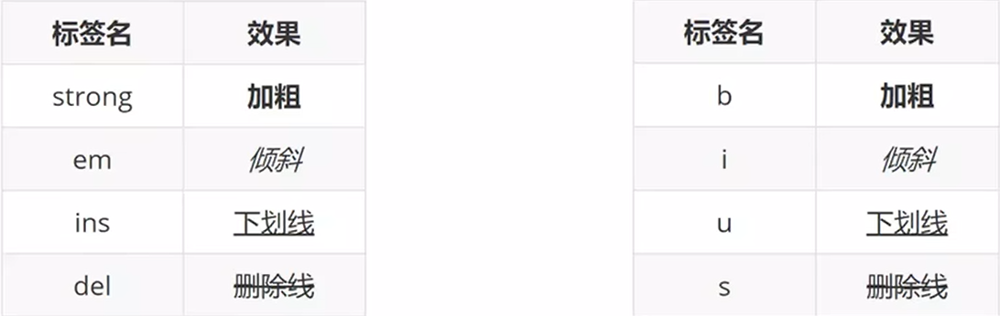

#### 网页标签(单标签)

**标签名：**````

**其他属性**

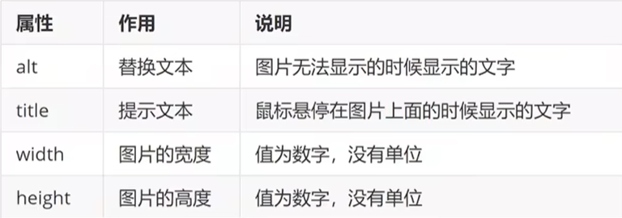

#### 路径

相对路径 **(常用)** ：从当前文件位置出发查找目标文件

绝对路径 **(友情链接)** ：从盘符出发查找目标文件

**符号含义**

当前文件所在文件夹：``.``

当前文件上一级文件夹：``..``

进入某个文件夹：``/``

**提示：当你看到其它啊网页上的LoGo，并想要在自己的网页上显示出来时，可以复制其地址填到网页标签的URL中**

#### 超链接标签(点击跳转到其它页面)

**标签名：**``<a href="网址" target="_blank">文字</a>``

空连接：``<a href="#">空连接</a>``当你点击时它不会跳转

**提示：** 这里的``target="_blank``新窗口跳转页面

#### 音频标签(双标签)

**标签名：**``<audio src="音频的URL">``

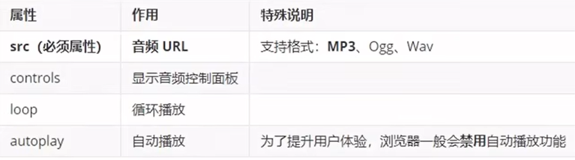

#### 视频标签(双标签)

**标签名：**``<video src="视频的URL">``

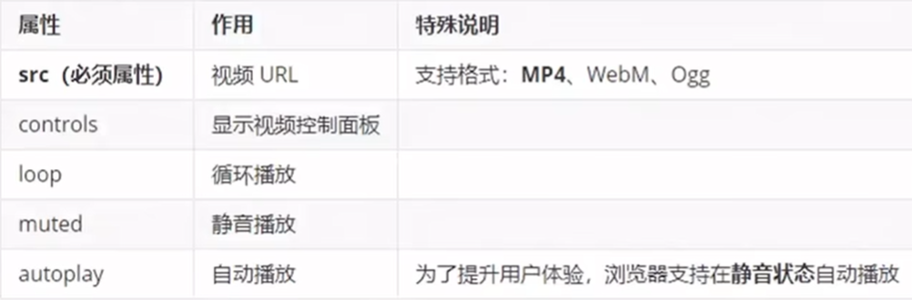

**提示：** 要想自动播放必须有静音播放属性


### 列表、表格、表单标签

#### 列表标签(布局内容排列整齐的区域)(双标签)

##### **无序列表**

**标签名：**

```
<ul>
    <li>第一项</li>
    ...
</ul>
```

**提示**

1. **ul**标签里面只能包裹**li**标签
2. **li**标签里面可以包裹任何内容

##### **有序列表**

**标签名：**

```
<oi>
	<li>第一项</li>
	...
</oi>
```

**提示**

1. **ol**标签里面只能包裹**li**标签
2. **li**标签里面可以包裹任何内容

##### **定义列表**

标签名

```
<dl>
	<dt>列表标签</dt>
	<dd>列表描述</dd>
	...
</dl>
```

**提示**

1. **dl**里面只能包含**dt**和**dd**
2. **dt**和**dd**里面可以包含任何内容

#### 表格标签(展示数据)(双标签)

**标签名：table**嵌套**tr**，**tr**嵌套**td**和**th**

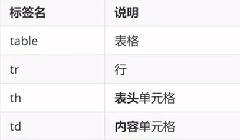

**提示：** 表格默认没有边框线，使用 ``border="数字"`` 属性可以为表格添加边框线

##### 合并单元格

**跨行合并和跨列合并**

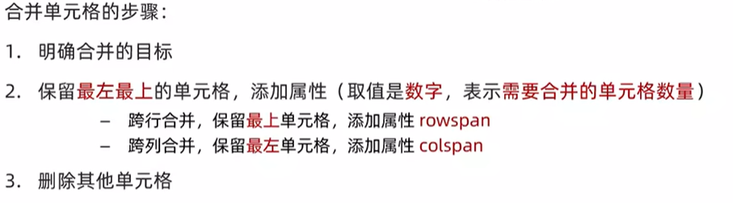

**提示：** 不能跨表格结构合并

#### 表单标签(收集用户信息)

##### input标签(单标签)

**标签名：**``<input type="属性值">``

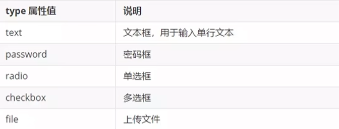

###### 占位文本(提示信息)(单标签)

**标签名：**``<input type="属性值" blaceholder="提示信息">``

**提示：** 一般给文本框和密码框去使用

###### 单选框radio

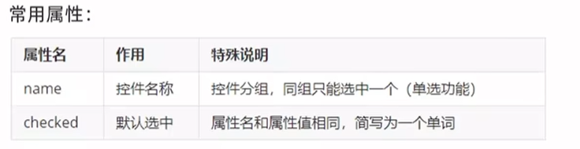

###### 上传文件-file(单标签)

**标签名：**``<input type="file" multiple>``

**提示：**默认情况下，只能上传一个文件，添加**multiple**属性可以实现文件多选功能

###### 多选框-checkbox(单标签)

标签名：``<input type="checkbox" checked>``文字(这里填写默认选项的文字)

**提示：checked**指的是默认选项

##### 下拉菜单(双标签)

**标签名：**

```
<select>
	<option selected>选项1</option>
	...
</select>
```

**提示：select**嵌套**option**，**select**是下拉菜单整体，**option**是下拉菜单的每一项，**selected**是默认选项

##### 文本域(双标签)

**标签名：**``<textarea>默认提示文字</textarea>``

**提示：**右下角有拖拽功能，用**CSS**将其禁用

##### lable标签(增大点击范围)(双标签)

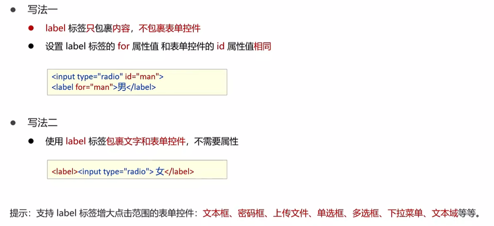

##### 按钮(双标签)

**标签名：**``<button type="属性值">文字</button>``

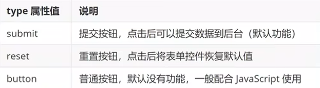

提示：要想让这些功能实现必须让``<form>内容</form>``包裹

##### 无语义的布局标签(布局网页)(双标签)

**标签名：**

独占一行：``<div>``

不换行：``<span>``

##### 字符实体(显示预留字符)

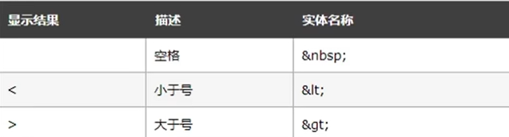