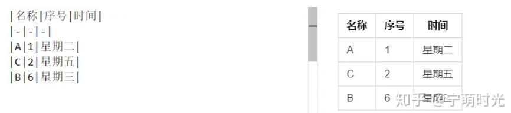

# Markdown笔记

## 基础知识

**字体加粗、斜体**

在加粗文字前后用 ****** 标记，在斜体文字前后用 ***** 标记,在加粗、斜体文字前后用 *********** 标记

**分割线**

在一行中用三个以上的**星号**、**减号**、**底线**来建立分割线

**下划线、删除线**

将文字填入 **<u> </u>** 中即可加下划线

在添加删除线文字前后用 **~~** 标记

**脚注(对文本的补充说明)**

格式为：**\[^要注明的文本]**

**引用**

在文字前面加上 **>**

**列表**

无序列表：在内容前面加上 **-  *  +** 

有序列表：在内容前面加上 **数字** + **.** + **空格** 的方式

**区块**

在文字前面加上一个 **>**

**代码**

如果只是段落上的一个函数或片段代码可以在前后加上 **`** 

**公式**

行内公式：在公式前后加上 **$**

独立公式：在公式前后加上 **$$**

**表格**



**转义符号**

若不想让Markdown标记生效，可以在每个符号前加上 **反斜杠(\\)**


## 进阶使用

**更改字体、大小、颜色**

改变字体

```<font face="黑体">黑体字</font>```

改变字体大小

```<font size=5>我是尺寸</font>```

字体改变颜色

```<font color="green">绿色字\</font>``` 

综合使用

```<font face="黑体" color=green size=5>我是黑体，绿色，尺寸为5</font>```

**为文字添加背景色**

``<table><tr><td bgcolor=yellow>背景色yellow</td></tr></table>``

**改变文字位置**

```text
<center>居中</center>
<p align="left">左对齐</p>
<p align="right">右对齐</p>
```

**上下标**

``<sub>我是下标</sub>``

``<sup>我是上标</sup>``

**超链接**

使用方法为 **\[链接名称](链接地址)**

***注：如果想要在新页面中打开可以使用下面这个***

``<a href="超链接地址" target="_blank">超链接名</a>``

**自动链接**

除了上面的超链接方式，还可以用 **< >** 将地址包起来


> 该笔记参考于<https://www.zhihu.com/tardis/zm/art/99319314?source_id=1003>
>