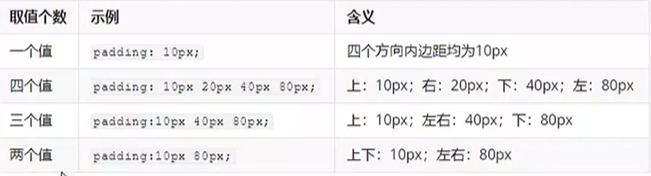

# CSS Notes

## 基础知识

**属性的书写方式:**``属性名: 属性值;``

定义：CSS主要是用来美化内容

书写位置：title标签下方添加**style**双标签，**style**标签里面书写**CSS代码**

CSS引入方式：


## 基础选择器

**通用写法：**``选择器 {属性名:属性值;}``

### 标签选择器

作用：使用**标签名**作为选择器，并且将该标签及同名标签的所有内容都设置成**相同**的格式

### 类选择器(常用)

作用：**差异化**设置标签的显示效果

步骤：

+ 定义类选择器 -> ``.类名``
+ 使用类选择器 -> 标签添加``class="类名"``
+ **示例**

**提示：**如果定义了多个选择器，并想让一个标签都将其使用，比如分别定义了**apple**和**orange**选择器，则可以按照``class="apple orange"``这样进行使用

### id选择器(一般与JS配合使用)

作用：**差异化**设置标签的显示效果

步骤：

+ 定义id选择器 -> ``#id``
+ 使用id选择器 -> 标签添加``id="id名"``

+ **示例**

  

**提示：**同一个id选择器在一个页面只能使用一次

### 通配符选择器

作用：查找页面所有标签，设置相同格式

格式：``* {属性名:属性值;}``

**提示：**不需要调用，浏览器会自动查找页面所有标签，设置相同格式

### 画盒子


**示例**


### 文字控制属性


#### 字体大小

属性值：单位为``px``

#### 字体粗细

属性值：


#### 字体样式(是否倾斜)

属性值：

+ 正常：``normal``
+ 倾斜：``italic``

#### 行高(设置文本间距)

属性值：

+ 数字+px
+ 数字(当前标签font-size属性值的倍数，默认为16px)

##### 行高-垂直居中

技巧：行高属性值等于盒子高度属性值

**提示：**只能是单行文字居中

#### 字体族

属性值：字体名

示例：``font-family: 楷体;``

拓展(了解即可)：该属性值可以写多个字体名。每个字体名用逗号隔开，执行顺序是从左至右依次查找，一般该属性值在最后会设置一个字体族名``sans-serif``

#### font符合属性


#### 文本缩进

属性值:

+ 数字+px
+ 数字+em(推荐：2em=也就是缩进当前标签字号大小的两个字)

#### 文本对齐

##### 水平对齐方式-文字

作用：控制内容水平的对齐方式


##### 水平对齐方式-图片


#### 文本修饰线


#### 文字颜色


## 复合选择器

定义：由多个基础选择器，通过不同的方式组合而成

作用：更准确，高效的选择目标元素(标签)

### 后代选择器


**提示：**会选中父类里面**所有**的后代

### 子代选择器


### 并集选择器


### 交集选择器


### 伪类选择器


## CSS三大特性

### 继承性

特性：子级默认继承父级的**文字控制属性**

**提示：**若标签有自己的样式，则生效自己的样式，不继承，若需要更改，则可以定义一个选择器，令其改变

### 层叠性

相同的属性会覆盖：后面的CSS属性**覆盖**前面的CSS属性

不同的属性会叠加：不同的CSS属性**都生效**

### 优先级

特性：当一个标签使用了多种选择器时，会选择优先级高的选择器生效

公式：通配符 < 标签 < 类 < id< 行内 < !important

**提示：**选择器自带属性选择的标签范围越大，优先级越低

**补充(!important的用法):**


#### 优先级-叠加计算规则


## 背景属性


### 背景图


### 背景图平铺方式


### 背景图位置


### 背景图缩放


### 背景图固定


背景复合属性


## 显示模式

### 块级

定义：独占一行；宽度默认是父级的100%；加宽高生效

### 行内

定义：一行共存多个；尺寸由内容撑开

### 行内块

定义：一行共存多个；默认尺寸由内容撑开；加宽高生效

### 转换显示模式


**提示：**前两个常用

## 结构伪类选择器

作用：根据元素的结构关系查找元素


### :nth-child(公式)

作用：根据元素的结构关系查找多个元素


## 伪元素选择器

作用：创建伪元素，用来摆放装饰性内容


**注意：**


## 盒子模型

作用：布局网页，拜访盒子和内容


### 边框线


#### 单方向边框线


### 内边距

作用：设置**内容**与**盒子边缘**之间的距离


#### 内边距-多值写法(简化代码)



记忆方法：从上开始顺时针旋转一圈，若当前方向没有数值，取值跟对面一样

### 尺寸计算

作用：用于解决border/padding撑大盒子的效果

解决**(第一种常用)**：

+ 手动做减法，减掉border/padding的尺寸
+ 内减模式(**自动固定盒子的尺寸**)：``box-sizing:border-box``;

### 外边距


**提示：**与**padding**属性值写法，含义**相同**

#### 外边距问题

##### 合并问题


##### 塌陷问题


解决方法：

+ 取消子级margin，父级设置padding
+ 父级设置``overflow：hidden``;
+ 父级设置``border-top;``

#### 版心居中

作用：让盒子居中

写法：``margin: 0 auto;``

**提示：**盒子必须有宽度，否则版心居中不生效

### 清除默认样式

写法：

```
* {
   margin: 0
   padding: 0;
}
```

#### 去掉列表的项目符号

写法：

```
li {
  list-style: none;
}
```

### 元素溢出

作用：控制溢出元素的内容的显示模式


### 行内元素-内外边距问题


### 圆角

作用：设置元素的外边框为圆角

属性名：``border-radius``

属性值：``数字+px/百分比``

**提示：**属性值是圆角半径

#### 多值写法

示例：

```
border-radius: 10px 20px 30px 40px;
```

记忆方法：从左上角顺时针赋值，没有值的角与对角取值相同

#### 常见应用

##### 正圆形状

给正方形盒子设置圆角属性值为 **宽高的一半/50%**

示例：


##### 胶囊形状

给长方形盒子设置圆角属性值为 **盒子高度的一半**

示例：


### 阴影

作用：给元素设置阴影效果

属性名：``box-shadow``

属性值：X轴偏移量 Y轴偏移量 模糊半径 扩散半径 颜色 内外阴影

**注意：**

+ X轴偏移量和Y轴偏移量**必须书写**
+ 默认是外阴影，内阴影需要添加**inset**