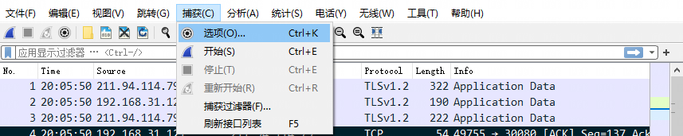

# Wireshark Notes


## 基本知识

用途：主要通过**开源抓包**来检测网络问题、攻击溯源、分析底层通信机制

抓包原理：在**单机**中，可以直接使用Wireshark进行抓取本机网卡的网络流量，而在**交换机**中，主要通过**端口镜像**、**ARP欺骗**等方式获取局域网中的网络流量


## 使用说明

### 界面介绍


从上到下，一共分为了六大部分，依次为菜单栏、工具栏、过滤栏、数据包列表、数据包详情和数据包字节

**菜单栏：**用于调试、配置

**工具栏：**常用功能快捷方式

**过滤栏：**指定过滤条件、过滤数据包

**数据包列表：**每一行就是一个数据包

**数据包详情：**数据包的详细数据

**数据包字节：**数据包对应的字节流、二进制


### 基础操作

#### 导出数据包

导出单个数据包：选中数据包，点击左上角的**文件**，点击导出**特定分组**


在导出分组界面，选择第二个Selected packets only，只保存选中的数据包


导出多个数据包**(将需要导出的数据都标记起来)**：点击左上角的**文件**，点击**导出特定分组**


在**导出分组界面**，勾选第三个**Marked packets only**，只导出标记的数据包


#### 开启混杂模式

混杂模式：通过开启该模式，可以解析其他mac的数据包

点击菜单栏的**捕获按钮**，点击**选项**



勾选在所有接口上使用混杂模式


### 过滤器操作

#### 抓包过滤器

作用：在抓包前使用，过滤掉不需要抓的包

BDF语法：主要有四个核心元素，分别为类型、方向、协议和逻辑运算符

+ 类型：host、net、port
+ 方向：src、dst
+ 协议：tcp、udp、http
+ 逻辑运算符：&&、||、！

```
//下面是两个例子

//抓取源IP为192.16831.1的数据包
src host 192.168.31.1
//抓取TCP或者UDP协议的数据包
tcp || udp
```

使用方式：

先停止抓包，点击工具栏捕获，点击选项


在弹出的界面最下方输入框输入过滤语句，点击开始进行抓包


#### 显示过滤器

作用：在抓包后或者过程中使用

语法：

+ IP地址：ip.addr、ip.src、ip.dst
+ 端口：tcp.port、tcp.srcport、tcpdstport
+ 协议：tcp、udp、http
+ 比较运算符：>、<、==、>=、<=、!=
+ 逻辑运算符：and、or、not、xor(有且仅有一个条件被满足)

```
//下面是两个例子

//显示IP地址为192.168.32.121的数据包
ip.addr == 192.168.32.121
//显示端口为80的数据包
tcp.port == 80
```

使用方式：

在过滤栏输入过滤语句，修改后生效

